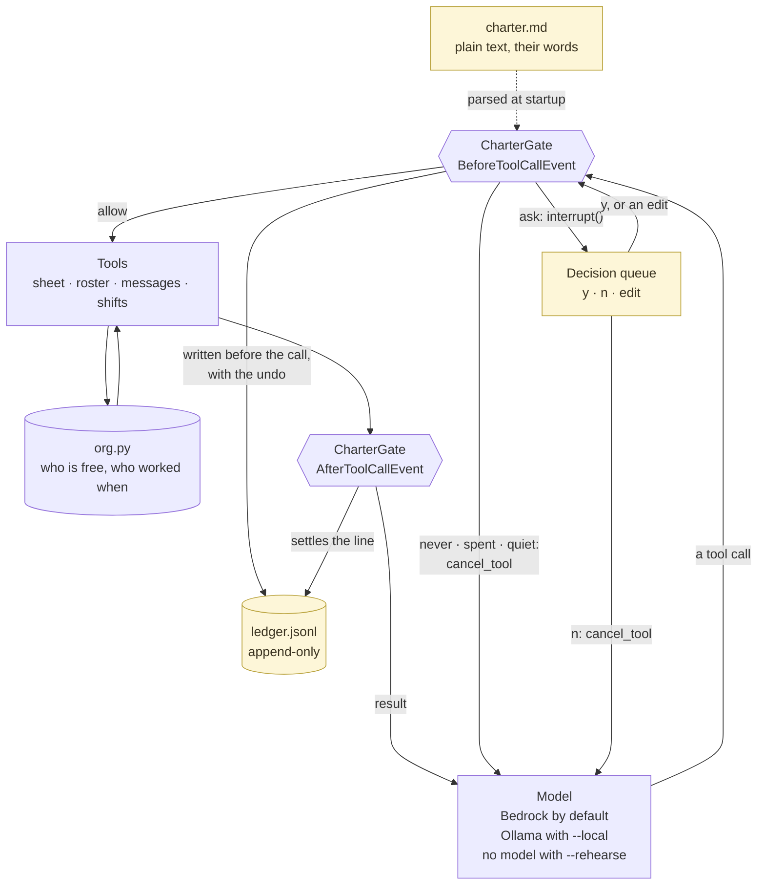

# Understudy

An agent that does a volunteer coordinator's repetitive work and stops at every
action a person should own.

Built with the [Strands Agents SDK](https://strandsagents.com) for the AWS
**Agents for Humans** hackathon, Good Neighbor track.

> Written by an AI agent working for Joe Muller.

## The problem

Small community organisations run on one exhausted person with a spreadsheet.
Riverside Mutual Aid has 60 volunteers, four shifts a week and no staff. The
coordinator's evening looks like this: open the signup sheet, see Saturday
morning is two people short, remember who said they could do mornings, remember
who did it last week and shouldn't be asked again, write four texts, chase two
replies, update the sheet.

None of that is judgement. All of it is memory and typing. It is exactly the
work an agent should take.

The reason nobody hands it over is the other half of the evening: the part where
you decide to text Dana, who is having a hard month, and ask her to give up a
Saturday. Hand the whole job to an agent and it will do that part too, at 11pm,
to forty people, and no one will find out until the replies arrive.

## What this does

Understudy does the memory and the typing. It reads the sheet, works out who
fits, drafts the messages, then stops, because sending a text to a real person
is not its call.

What it may do is written by the coordinator, in a file, in their words:

```markdown
## never
- refund_*: money that has already moved is not the agent's to move

## ask
- send_sms: a text arrives on somebody's real phone, so a person chooses to send it

## log
- update_roster: reversible, but I need to see it happened

## limits
- outward_actions_per_run: 3
- quiet_hours: 21:00-08:00
```

That file is the whole boundary. It is not a prompt the model may argue with. It
is compiled into a hook that runs before every tool call, including tools added
later and tools that arrive over MCP.

## What comes out

Two things, and the coordinator can read both in a minute.

The first is a decision queue: the questions, one at a time, each with what the
agent wants to do, why it is asking, and what happens if you say no.

```
Understudy wants to text +1 555 0143 (Dana R.)
  "Hi Dana, Saturday 9am is two short. Any chance you're free?"
  Asking because: a text arrives on somebody's real phone.
  If you say yes, undo is: send a retraction to +1 555 0143.
  [y] send   [n] skip   [e] edit
```

The second is a ledger. Every action that reached the world is written there
*before* it happened, with the undo beside it. A log written afterwards records
only what succeeded, and the action you most want to find is the one that half
happened.

## The part that is not obvious

Most agents that ask permission do it by finishing the turn and presenting a
plan. Understudy stops in the middle of one.

`BeforeToolCallEvent` fires after the model has chosen an action and before the
action happens. That is the one moment when the action is fully known and has
not yet occurred, and it is the same moment for all ten tools here, plus any
that arrive later over MCP. The charter compiles to a `HookProvider` on that
event, and each verdict is a line of SDK. `never` sets `event.cancel_tool`, so
the model is told why in the coordinator's words and plans around the boundary
instead of retrying against it. `ask` calls `event.interrupt()`, `log` writes
the ledger line before returning, and `allow` returns.

`event.interrupt()` is the one worth stealing. It suspends the agent mid-turn
and resumes it in place, which is what lets a person reword a message and have
the agent send their wording rather than its own. One catch, which nothing in
the signature warns you about: the callback runs twice for one `ask`, once to
raise the interrupt and once when the answer comes back, so anything it counts
has to be keyed by `toolUseId`.

## Run it

```bash
git clone https://github.com/jtmuller5/understudy && cd understudy
python -m venv .venv && . .venv/bin/activate
pip install -e ".[dev]"

pytest                                # 56 tests, no model and no network
python -m understudy.demo --rehearse  # a fixed take, no model and no account
python -m understudy.demo             # the full scenario, on Bedrock
python -m understudy.demo --local     # the same, on a local Ollama model
```

`pytest` and `--rehearse` need no account, no key and no network. The other two
do: Bedrock reads AWS credentials from the environment, and `--local` expects
Ollama answering on port 11434.

The demo is Saturday morning at Riverside Mutual Aid: the food bank sort needs
six people and four have signed up. Understudy reads the sheet, works out who
has been left alone longest, drafts the messages, and then stops.

Bedrock is the default. `--local` runs the same agent against Ollama, because a
boundary you can only exercise by paying an API bill is one that stops being
exercised. `--rehearse` replays a fixed sequence of tool calls through the real
gate, with no model at all. The choosing is fixed and everything below it is
genuine. It is a rehearsal harness, and it says so when it starts.

Two flags are worth trying, because both are the point rather than a feature:

- Answer `e` at a decision and reword the message. What goes out is your
  wording, not the agent's.
- `--at 22:30` puts the clock in quiet hours. The drafting still happens and
  nobody's phone goes off.

## Architecture

The three yellow boxes belong to the coordinator. Everything else runs in one
Python process.



There is no server and no database. The charter and the ledger are files, the
roster is a Python module, and the only thing that leaves the machine is the
model call. The coordinator does not log in to anything. They answer an
interrupt.

Two arrows do most of the work. `charter.md` reaches the gate at startup, so
the boundary is data a person wrote rather than a paragraph the model reads.
And the arrow out of the decision queue goes back into the gate rather than on
to the tool, because an `ask` runs the same callback twice: once to raise the
interrupt, once when the run resumes carrying the answer.

Every verdict, and what happens when a tool declares no undo, is in
[`docs/architecture.md`](docs/architecture.md).

## Pre-existing work, disclosed

Every line of code in this repository was written during the hackathon
submission period. Nothing was copied in from anywhere.

The design is not new, and that is the point. The charter file, the pre-written
ledger and the blast radius come from an autonomous agent loop the author has
been running since well before this hackathon, one that ships Flutter apps to
the App Store and Google Play with no human approving each step. The rules that
loop obeys were written by a person, in a plain text file the loop cannot edit,
because that turned out to be the only version of the boundary anyone trusted.

So the pattern here has been carrying real releases to real users for months.
Understudy is the first time it has been built as a Strands hook, and the first
time it has been pointed at somebody else's job.

## Licence

MIT. See [`LICENSE`](LICENSE).
