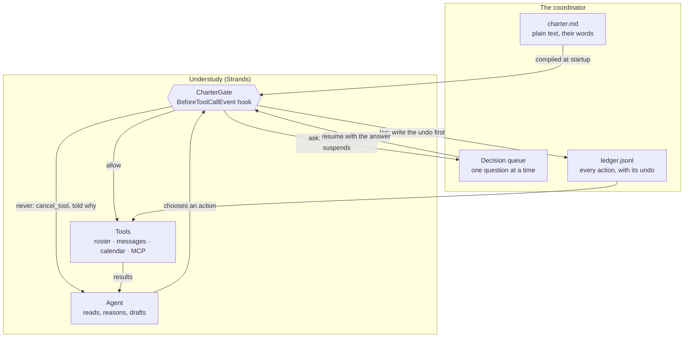

# Architecture

## The shape

## Why the gate is a hook and not a prompt

`BeforeToolCallEvent` fires after the model has chosen an action and before the
action happens. That is the only moment in an agent's life when the action is
fully known and has not yet occurred, and it is the same moment for every tool,
including tools added later and tools that arrived over MCP.

The alternatives fail in ways that are easy to miss:

| Where the boundary lives | How it fails |
|---|---|
| The system prompt | It is advice. A model under pressure argues past it, and nothing records that it did. |
| Inside each tool | Correct until somebody adds tool number nine, or an MCP server brings forty. |
| A human approving every step | The coordinator now has a second job, so they stop reading and click yes. |
| The hook | Runs once per action, for every tool, and cannot be talked out of. |

## The four verdicts

| Verdict | What happens | Strands mechanism |
|---|---|---|
| `allow` | The action runs. Reading and drafting cost nothing and are reversed by ignoring them. | none — the hook returns |
| `log` | The ledger line is written **first**, with the undo, then the action runs. | `Ledger.record()` before return |
| `ask` | The run suspends. The question, its arguments and the undo go to the coordinator; the run resumes where it stopped with their answer. | `event.interrupt()` |
| `never` | The tool is cancelled and the model is told why, in the charter's words, so it plans around the boundary instead of retrying against it. | `event.cancel_tool = reason` |

Two limits apply to everything except `allow`: a blast radius (a run may take
only N outward actions, so a bad pattern cannot outrun the person reading it)
and quiet hours (nothing reaches a phone at 23:00).

A gated tool that declares no undo raises at the gate rather than running. The
undo is rarely needed. Being unable to state one means nobody understood the
action well enough to take it.

## Components

| File | Holds |
|---|---|
| `understudy/charter.py` | Parses `charter.md`. Strictest matching rule wins. |
| `understudy/gate.py` | `CharterGate`, a `HookProvider` on `BeforeToolCallEvent`. |
| `understudy/ledger.py` | Append-only JSONL, `O_APPEND`, secret-looking values redacted. |
| `understudy/tools/` | The coordinator's actual work: roster, messages, calendar. |
| `tests/test_gate.py` | The safety claim, exercised with no model and no network. |
