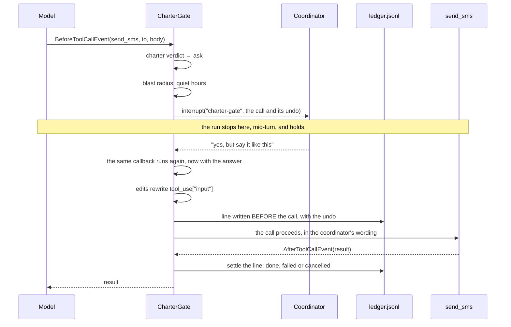

# Architecture

## The shape

The diagram of what calls what is in the [README](../README.md#architecture),
where a reader gets to it first. This file is the second look: one gated call
from end to end, and the reasons behind the design.

Two things in that sequence are easy to miss and both are load-bearing. The
callback runs twice for one decision, so anything it appends to has to be keyed
by `toolUseId` or every `ask` is counted double. And the ledger is written on
the way in rather than on the way out, then settled afterwards, because a log
written only on success cannot show you the action that half happened.

## Why the gate is a hook and not a prompt

`BeforeToolCallEvent` fires after the model has chosen an action and before the
action happens. That is the only moment in an agent's life when the action is
fully known and has not yet occurred, and it is the same moment for every tool,
including tools added later and tools that arrived over MCP.

The alternatives fail in ways that are easy to miss:

| Where the boundary lives | How it fails |
|---|---|
| The system prompt | It is advice. A model under pressure argues past it, and nothing records that it did. |
| Inside each tool | Correct until somebody adds tool number nine, or an MCP server brings forty. |
| A human approving every step | The coordinator now has a second job, so they stop reading and click yes. |
| The hook | Runs once per action, for every tool, and cannot be talked out of. |

## The four verdicts

| Verdict | What happens | Strands mechanism |
|---|---|---|
| `allow` | The action runs. Reading and drafting cost nothing and are reversed by ignoring them. | none, the hook returns |
| `log` | The ledger line is written **first**, with the undo, then the action runs. | `Ledger.record()` before return |
| `ask` | The run suspends. The question, its arguments and the undo go to the coordinator; the run resumes where it stopped with their answer. | `event.interrupt()` |
| `never` | The tool is cancelled and the model is told why, in the charter's words, so it plans around the boundary instead of retrying against it. | `event.cancel_tool = reason` |

Two limits apply to everything except `allow`: a blast radius (a run may take
only N outward actions, so a bad pattern cannot outrun the person reading it)
and quiet hours (nothing reaches a phone at 23:00).

A gated tool that declares no undo raises at the gate rather than running. The
undo is rarely needed. Being unable to state one means nobody understood the
action well enough to take it.

## Components

| File | Holds |
|---|---|
| `understudy/charter.py` | Parses `charter.md`. Strictest matching rule wins. |
| `understudy/gate.py` | `CharterGate`, a `HookProvider` on `BeforeToolCallEvent`. |
| `understudy/ledger.py` | Append-only JSONL, `O_APPEND`, secret-looking values redacted. |
| `understudy/tools.py` | The coordinator's actual work: the sheet, the roster, the messages. |
| `understudy/org.py` | The organisation the tools act on. Invented; see below. |
| `understudy/coordinator.py` | Model, tools and gate assembled into an agent. |
| `understudy/demo.py` | The Saturday-two-short scenario and the decision queue. |
| `tests/` | The safety claim and the rest rule, with no model and no network. |

## The third answer

The decision queue takes four answers, and the third is the one that decides
whether any of this is used. "Yes, but say it like this" is the commonest real
reply, and an approve/deny pair cannot express it, so the coordinator denies,
opens the messaging app, and types it themselves. The agent has then saved them
nothing and cost them a notification.

So the gate applies the edit to the tool call itself. What goes out is the
person's wording, and the ledger records the arguments as sent rather than as
proposed.

## The rest rule

`find_available_volunteers` holds back anybody who worked inside the last seven
days, and reports them separately with the reason rather than dropping them. The
coordinator can still choose to ask. This is the piece of the job that is
genuinely memory rather than judgement, and the piece a tired person does worst
at 11pm. That is the honest case for the agent existing at all.

## The data

Every person, number and address under `examples/` is invented. The 555 range
and `example.org` are reserved, so nothing in this repo can reach a person.
